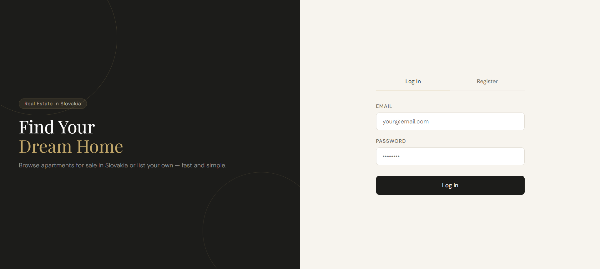
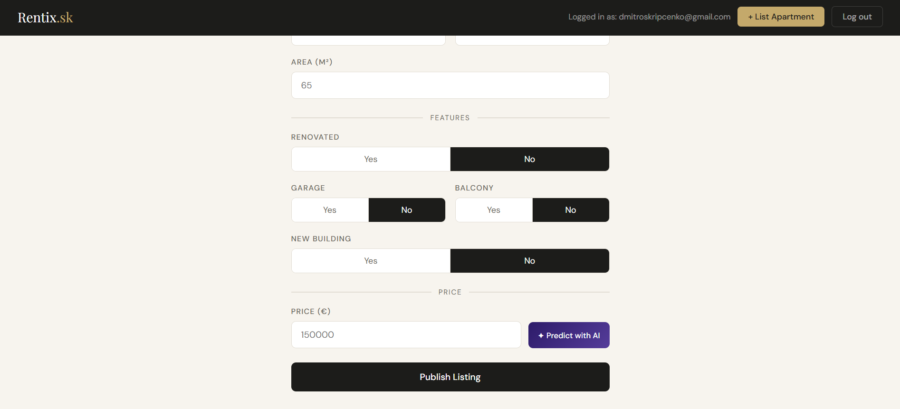
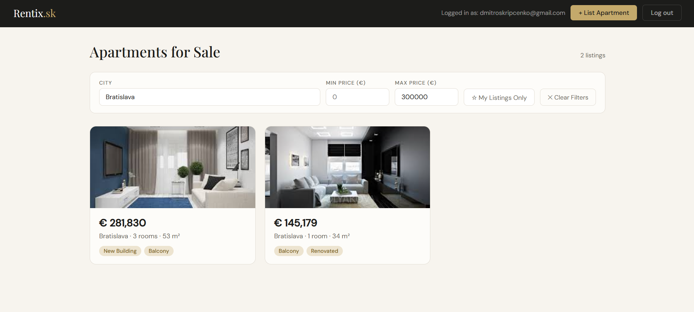
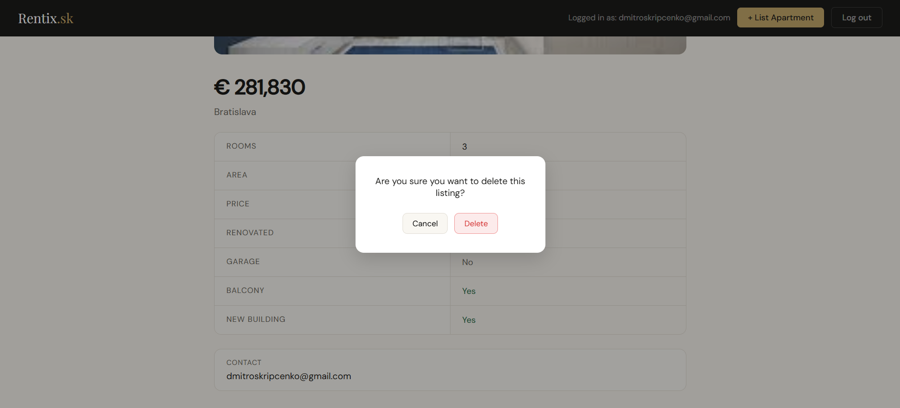

# 🏠 Apartment marketplace with price prediction using machine learning

This project is an apartment marketplace that integrates a machine learning model for apartment price prediction. Users can explore apartment listings and estimate property prices based on selected features such as size, number of rooms, location, and additional attributes. As part of the project, the web application and the ML prediction service were deployed on different cloud providers.


## 📁 Project Structure

```
Apartment-marketplace-with-price-prediction-using-ML/
│
├── images/
│
├── ML/
│  ├── api/
│  ├── model_training/
│
├── Web_App/
│  ├── backend/
│  ├── frontend/
│  ├── .env
│  ├── .gitignore
│  ├── docker-compose.yml
│
├── README.md

```

- images/ folder with images used in the README.
- ML/api/ folder with the ML prediction API.
- ML/model_training/ folder with jupyter notebooks for data analysis and model training.
- Web_App/backend/ folder with the backend of the web application.
- Web_App/frontend/ folder with the frontend of the web application.
- Web_App/.env file with environment variables for the application.
- Web_App/.gitignore file specifying files ignored by Git.
- Web_App/docker-compose.yml file for running the full web application stack using Docker.
- README.md provides project overview and instructions.


## 🤖 Price Prediction Model

The machine learning component of the project focuses on predicting apartment prices based on apartment characteristics. The model was trained on the Apartment Prices in Slovakia dataset available on Kaggle: https://www.kaggle.com/datasets/petervboch/apartment-prices-in-slovakia.


The original dataset contains 7,442 apartment listings with 11 attributes describing various characteristics of apartments offered for sale. During the preprocessing stage, several filtering steps were applied to remove invalid or unrealistic records:

- apartments with 0 rooms  
- apartments with size ≤ 10 m²  
- listings with price ≤ 30,000  
- listings located in "Česká republika"


After preprocessing, the dataset used for training contained the following features:

- rooms – number of rooms in the apartment  
- size – apartment size in square meters  
- reconstructed – whether the apartment has been reconstructed  
- garage – availability of a garage  
- balcony – presence of a balcony  
- new – whether the apartment is located in a new building  
- location – city where the apartment is located

The target variable used for training is:

- price - selling price of the apartment


Several regression algorithms were evaluated during experimentation:

- Linear Regression  
- Random Forest Regressor  
- XGBoost Regressor  

After comparing their performance, XGBoost was selected as the final model due to its superior predictive accuracy. Model performance on the test dataset:

- MAE (Mean Absolute Error): 34,984  
- MAPE (Mean Absolute Percentage Error): 21.8%  
- R² Score: 0.656 

After the training phase, the selected model was exported and integrated into a prediction service. A REST API was then implemented to serve the trained model, allowing external applications to send apartment features and receive predicted price estimates. 


## 💻 Web Application 

The web application allows users to browse apartment listings and create new listings for apartments they want to sell. Users can filter listings by city and price range, view detailed information about each apartment, and manage their own listings. When creating a new listing, users can enter apartment details such as size, number of rooms, location, and additional attributes. The application also provides a "Predict with AI" button that allows users to estimate the apartment price using the trained machine learning model.

Login and registration page:



Apartment listing form with the AI price prediction feature:



List of available apartments with filtering options:



Apartment detail page with full listing information:




## 🏗️ Architecture of the Solution

```
User Browser
      │
      ▼
React Frontend (Azure VM)
      │
      ├──► FastAPI Backend (Azure VM)
      │        │
      │        ▼
      │   PostgreSQL Database (Azure VM)
      │
      └──► ML Prediction API (GCP Cloud Run)
               │
               ▼
          XGBoost Model
```

The system consists of a web application for apartment listings and a separate machine learning prediction service deployed on different cloud platforms. <br>

The web application is deployed on a Microsoft Azure Virtual Machine and is built using Docker Compose, which orchestrates multiple containers including the React frontend, FastAPI backend, and PostgreSQL database. The frontend port is exposed so the application can be accessed through a web browser. <br>

Users can browse apartment listings and create new listings for apartments they want to sell. When submitting apartment information, the frontend provides a "Predict with AI" button. When this button is pressed, the frontend sends a POST request containing the apartment features to a machine learning prediction API. <br>

The ML prediction service is deployed separately on Google Cloud Platform using Cloud Run, where a containerized FastAPI application hosts the trained XGBoost model. The service processes the request and returns the predicted apartment price via a REST API response. <br>


## 🔗 Live Deployment

During the deployment of the project, free-tier cloud services were used. Because of these limitations, the deployed services will only be available for a limited time.

- **Web Application (Azure VM)** <br>
  Available until 24.05.2026 <br>
  Link: http://4.239.244.183:3000 <br>

- **ML Prediction API (GCP Cloud Run)** <br>
  Available until 06.07.2026 <br>
  Link: https://apartment-price-prediction-api-131689818682.europe-central2.run.app <br>

The ML prediction API can also be tested directly without the web application. An example request is provided in the section [Running the API with the Price Prediction Model](#-running-the-api-with-the-price-prediction-model-docker). To use the deployed version of the API, simply replace the `http://localhost:8080` URL in the example with the deployed `https://apartment-price-prediction-api-131689818682.europe-central2.run.app`.

If the deployed services are no longer available, the project can still be run locally by following the instructions in the sections [Running the API with the Price Prediction Model](#-running-the-api-with-the-price-prediction-model-docker) and [Running the Web Application](#-running-the-web-application-docker) sections.


## 🛠️ Tools Used

For data analysis and training the ML model:

- Python (Pandas, Matplotlib, Searbon, Scikit-learn, XGBoost)
- Jupyter Notebook

For creating an API with the ML model:

- FastAPI
- Docker

For creating a web application:

- React.js
- FastAPI
- PostgreSQL
- Docker


## ⚡ Installation

1. Clone the repository: <br>

   `git clone https://github.com/TheDim0nu4/Apartment-marketplace-with-price-prediction-using-ML.git` <br>
   `cd Apartment-marketplace-with-price-prediction-using-ML` <br>


## 🧠 Running Jupyter Notebooks (Conda)

1. Open the folder with the jupyter notebooks: <br>

   `cd ML/model_training` <br>

2. Create a Conda environment: <br>

   `conda create -n apartment_predict_env python=3.11` <br>

3. Activate the environment: <br>

   `conda activate apartment_predict_env` <br>

4. Install project dependencies: <br>

   `python -m pip install -r requirements.txt` <br>

5. Select the environment kernel in Jupyter: <br>

   - Open the notebooks and select the kernel corresponding to the created Conda environment (apartment_predict_env).
   - After selecting the kernel, you can run the notebook cells and start working with the project.


## 🚀 Running the API with the Price Prediction Model (Docker)

1. Open the folder with the API: <br>

   `cd ML/api` <br>

2. Build the Docker Image: <br>

   `docker build -t apartment-ml-api .` <br>

3. Running the container: <br>

   `docker run -p 8080:8080 apartment-ml-api` <br>

4. Using the API (Python example): <br>

   ```python
   import requests

   url = "http://localhost:8080/get-apartment-price-prediction"

   data = {
      "rooms": 3,
      "size": 75,
      "reconstructed": "Yes",
      "garage": "No",
      "balcony": "Yes",
      "new": "No",
      "location": "Bratislava"
   }

   response = requests.post(url, json=data)
   print(response.json())
   # {'predicted price': 299419.5}
   ```


## 🌐 Running the Web Application (Docker)

1. Run the API with the price prediction model (See the instructions above) <br>

2. Open the folder with the web application: <br>

   `cd Web_App` <br>

3. Build and run the application using Docker Compose: <br>

   `docker compose up --build` <br>
   
   The application will be available at the URL: http://localhost:3000 <br>

4. Stop the application: <br>

   `docker compose down -v` <br>


## ✍️ Authors

This project was implemented in the summer semester of 2026 in the subject of Cloud technologies. The project was carried out by Dmytro Skrypchenko (ML part), Nikita Dakhno (backend of the web application), Daria Rezvin (frontend of the web application).


